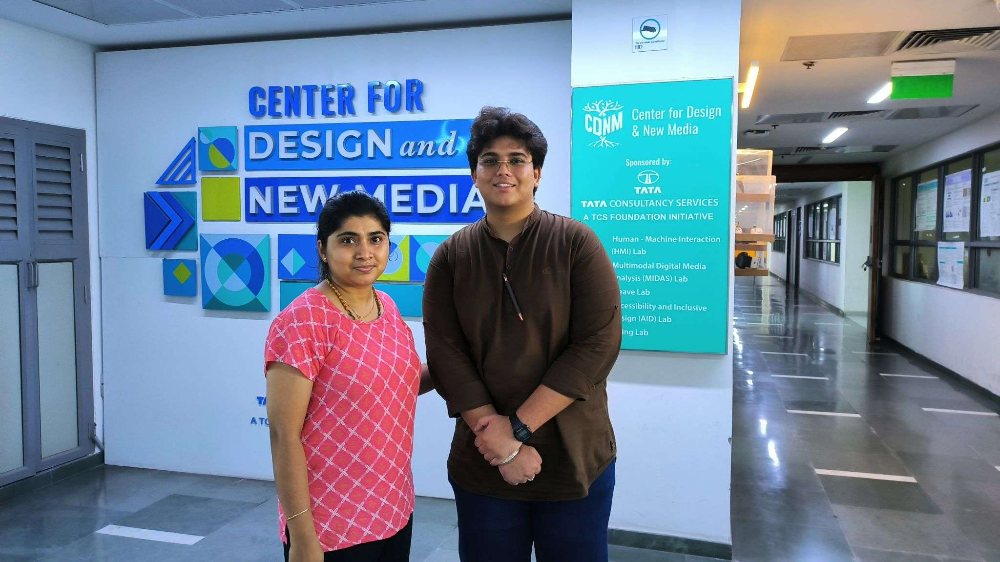
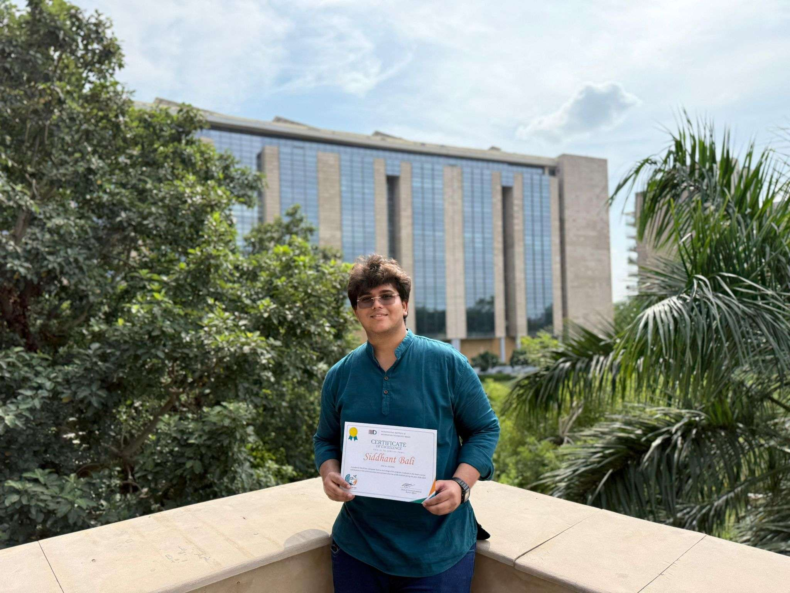
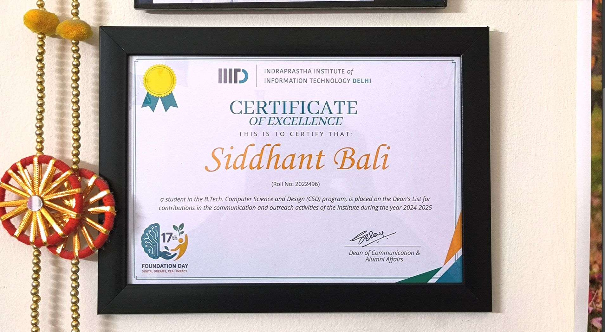
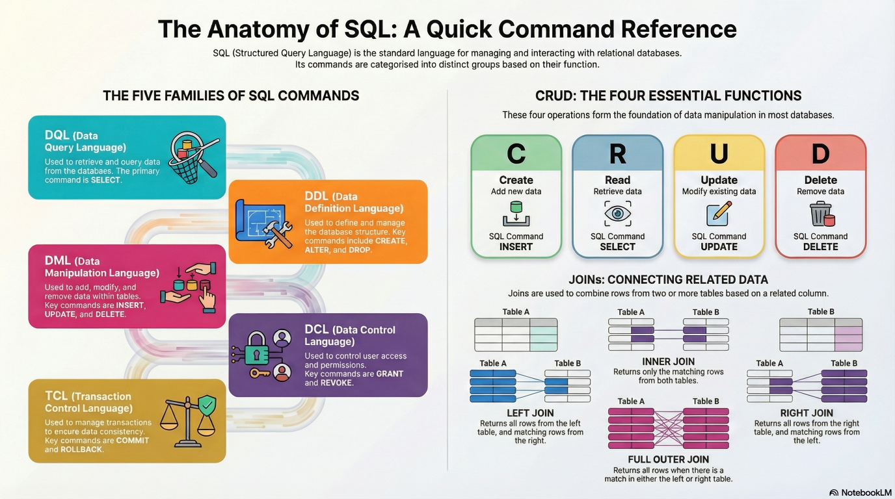
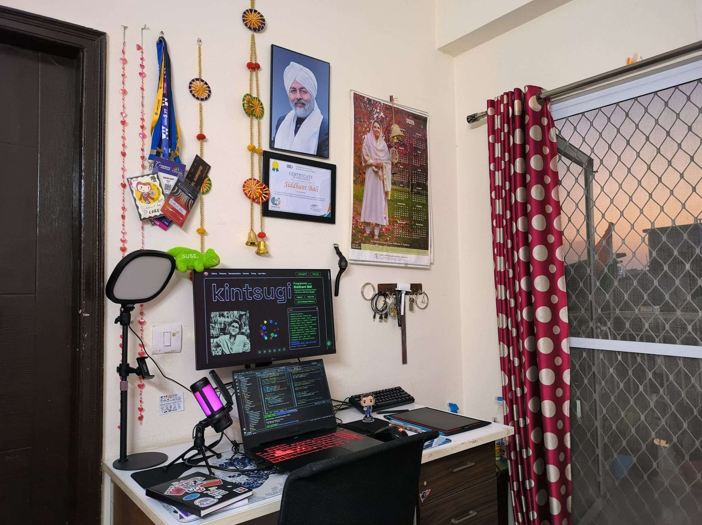

<h1 align="center">Hi 👋, I'm Siddhant Bali 👨‍💻 </h1>
<h3 align="center"> Researcher | Web Developer | UI/UX Designer | Computer Science Sorceror from India</h3>

  

> `Coding is Meditation` @[https://www.kintsugidev.studio/](https://www.kintsugidev.studio/)

I am Siddhant Bali 🐻, a full-stack web developer with ~2 years of production engineering experience, specializing in building scalable, secure, and high-performance web platforms using TypeScript, REST architectures, and modern full-stack frameworks.

I work across backend engineering, frontend systems, UI/UX-driven development, and Linux-based deployments | delivering production-ready solutions for labs, institutions, and organizations that require reliability at scale.

I am an undergraduate student (Batch 2026) in **Computer Science & Design** at **IIIT Delhi**

My focus areas include **backend engineering**, **system design**, **scalable web platforms**, and **AI-driven applications**.

---

## 🧩 Technical Profile

### **Core Expertise**

* **Backend Engineering:**
  Python (Flask/FastAPI), Node.js, Express, REST APIs, session management, authentication, data modeling.

* **Full-Stack Development:**
  React, Next.js, Tailwind CSS, TypeScript, responsive UI, SEO, accessibility, build optimization.

* **Systems & Infrastructure:**
  Linux scripting & automation, Apache/NGINX deployments, SSL/HTTPS, server hardening, CI/CD basics.

* **Databases:**
  MySQL, PostgreSQL, MongoDB, relational modeling, indexing, query optimization.

* **AI & Automation:**
  LLM integration, agentic workflows, AI-as-a-Service (AAA-S), prompt engineering, vector stores.

### **Engineering Practices**

* Version control (Git/GitHub)
* Production debugging
* Progressive refactoring
* Secure coding practices (OWASP-inspired)
* Documentation & architectural clarity
* Working with cross-functional teams (designers, researchers, clinicians)
* Delivery under constraints (time, complexity, stakeholder pressure)

---

## 🏢 Professional Experience (Condensed)

### **1. IIITD | Human-Centered Design (HCD) Department**

*Web Developer & Linux Automation*

* Revamped legacy lab websites.
* Migrated to React + modern pipelines.
* Automated server tasks on Linux environments.
* Delivered multiple projects consistently, leading to continued institutional work.

### **2. Persisst Lab | Server & Web Systems**

* Deployed production-ready full-stack systems.
* Collaborated with designers and junior developers.
* Introduced workflows for reliability and code quality.

### **3. Microbiome Informatics Lab → AIIMS Delhi Recommendation**

* Automation tools for Linux environments.
* Website modernization + operational tooling.
* Received direct recommendation for national-level deployment roles.

### **4. AIIMS Delhi & ICMR | Full-Stack Developer**

**Built an end-to-end clinical data platform:**

* Deployed across **8 hospitals**, with **800+ patient workflows**.
* Implemented video-data entry pipelines.
* Designed session, role, and abstraction layers for multi-center testing.
* Ensured reliability during high-stakes medical evaluations.
* Interacted with senior clinicians, directors, and domain experts.

### **5. High-Impact IIITD Projects**

* Delivered conference & institute websites under strict deadlines.
* Built the **1Pixel Design Conference** website single-handedly under 24 hours.
* Optimized for speed, SEO, security, and cross-device performance.

### **6. Corporate & External Projects**

* CA/CS Bhatiya & Associates, Pune
* Institute Innovation Council
* Center for Design and New Media (TCS Foundation × IIITD)
* Trained junior developers in production standards, Git workflows, deployment fundamentals, and design-engineering collaboration.

|  |  |
|---|---|

---

## 🏅 Recognitions

### **Distinguished Dean’s List Award (2024–25)**

Recognized for exceptional contributions to IIIT Delhi’s communication and outreach initiatives.

|  |  |  |
|---|---|---|

---

## 🔬 Current Interests

* **Full-Stack Generative & Agentic AI**
* **AI System Reliability & Safety**
* **Autonomous workflow design**
* **Secure distributed systems**
* **Red-team to blue-team cybersecurity fundamentals**

---

## 🛠 Selected Projects

* [https://digitaldrz.vercel.app/](https://digitaldrz.vercel.app/)
* [https://telemetrytrade.vercel.app/](https://telemetrytrade.vercel.app/)
* [https://csbhatiya.com/](https://csbhatiya.com/)
* [https://persisst.iiitd.edu.in/](https://persisst.iiitd.edu.in/)
* [https://hcd.iiitd.ac.in/](https://hcd.iiitd.ac.in/)
* [https://1pxdesignconf.iiitd.edu.in/2025/](https://1pxdesignconf.iiitd.edu.in/2025/)
* [https://dss2025.iiitd.edu.in/](https://dss2025.iiitd.edu.in/)
* [https://www.kintsugidev.studio/chat](https://www.kintsugidev.studio/chat)
* [https://lifelore.vercel.app/](https://lifelore.vercel.app/)
* [https://karmos.vercel.app/](https://karmos.vercel.app/)
* [https://digitaldrz.vercel.app/](https://digitaldrz.vercel.app/)
* [https://sarkarisahyogai.vercel.app/](https://sarkarisahyogai.vercel.app/)
* [https://vital-link-hcl.vercel.app/](https://vital-link-hcl.vercel.app/)

---

## 🌐 Community & Leadership

* Lead | Design Core Team, IIITD Cultural Council
* Lead | Web Dev Team, 1Pixel Design Conference
* Lead | Videography, IIITD Sports Council
* Mentor | B.Tech Induction Program
* Core Team | E-Cell, E-Summit
* Volunteer | SNM, NSS, SOPS

---

## 📈 Additional Links 

* GitHub (1000+ commits): [https://github.com/kintsugi-programmer](https://github.com/kintsugi-programmer)
* Blog: [https://kintsugicodes.hashnode.dev/](https://kintsugicodes.hashnode.dev/)
* Design Portfolio: [https://www.behance.net/balibhai](https://www.behance.net/balibhai)
* LinkedIn: [https://www.linkedin.com/in/kintsugi-programmer/](https://www.linkedin.com/in/kintsugi-programmer/)

<h3 align="left">Connect with me:</h3>

  

<h3 align="left">Support:</h3>

  

<h3 align="center">Statistics</h3>

<a href="https://github.com/KINTSUGI-PROGRAMMER">

---

## 👨‍💻 KintsugiStack

| <a href="https://github.com/kintsugi-programmer/kintsugi-stack-java">   
**java**
</a> | <a href="https://github.com/kintsugi-programmer/kintsugi-stack-sql">   
**sql**
</a> | <a href="https://github.com/kintsugi-programmer/kintsugi-stack-dsa-java">   
**dsa-java**
</a> |
|---|---|---|

|  | 
 |
|---|---|

--- 

Thank You !!!

> Love Youself and all around you & Save trees

Made with 💚 [kintsugi-programmer](https://github.com/kintsugi-programmer)